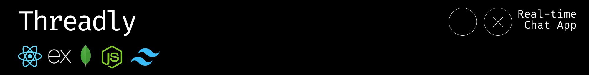
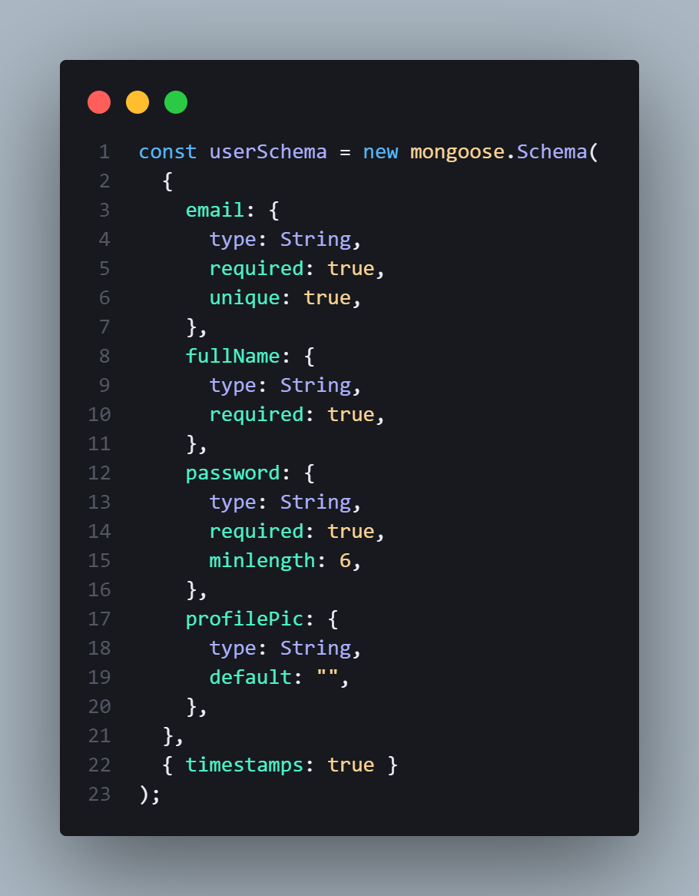
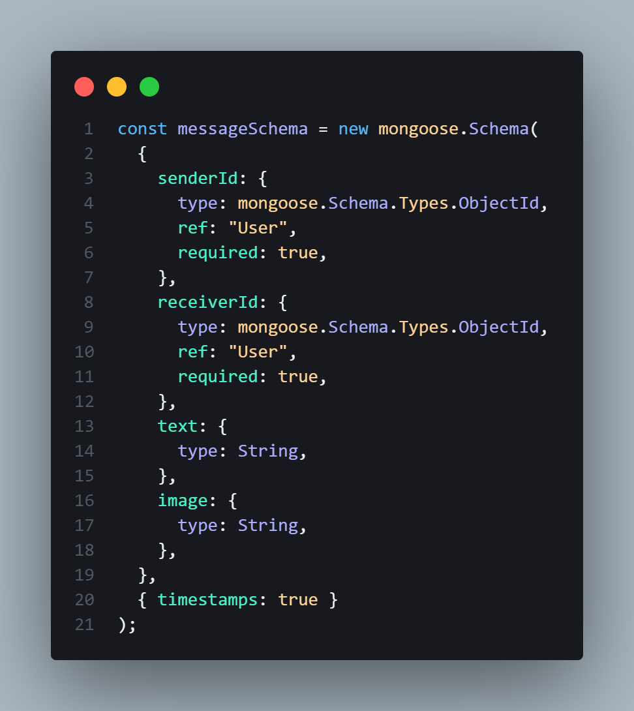
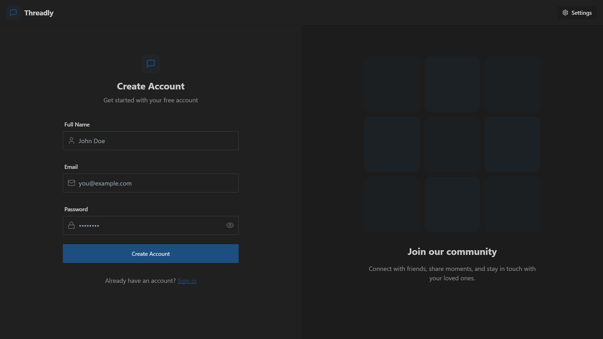
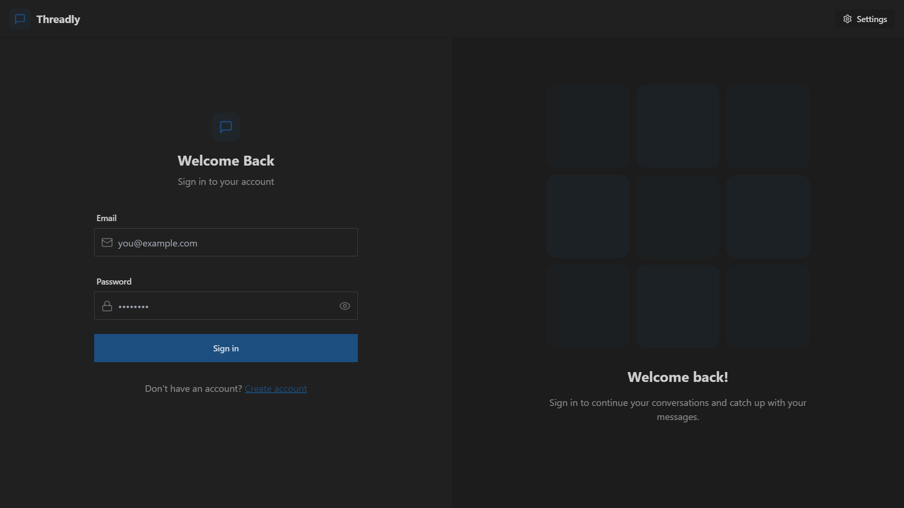
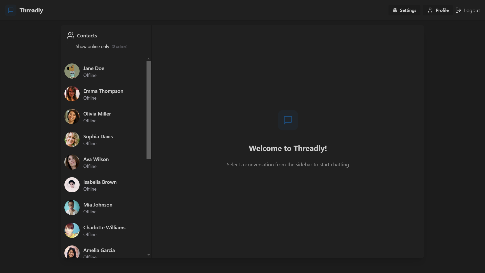
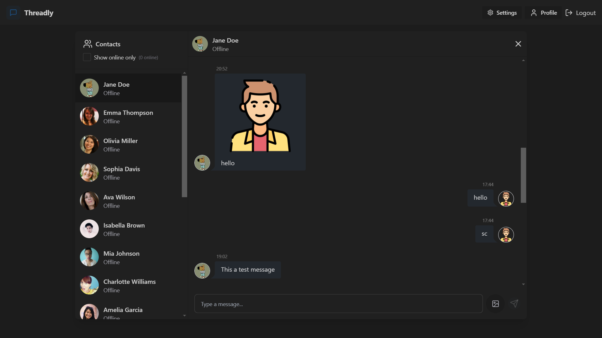
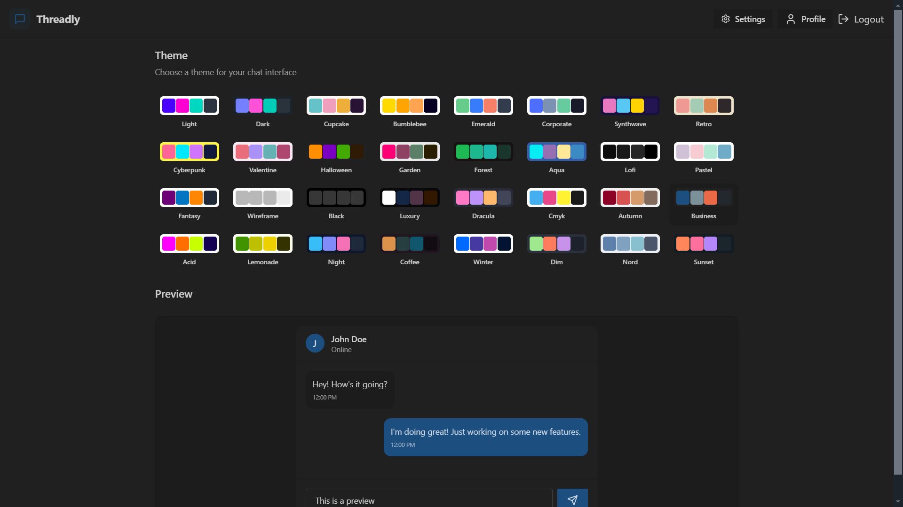
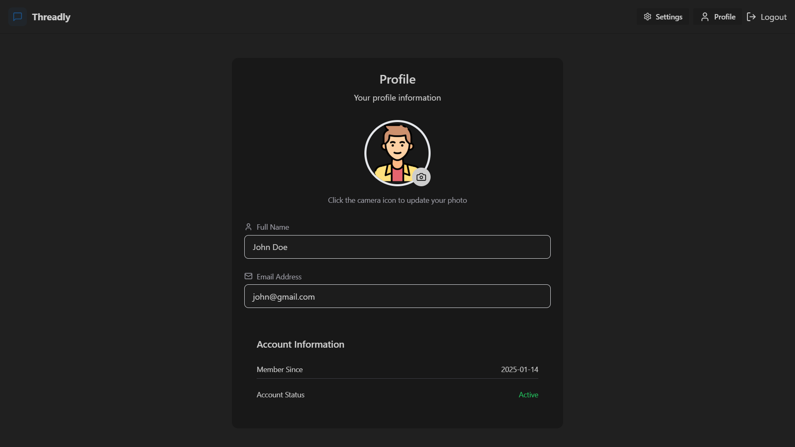

> Threadly is a modern, real-time chat application engineered with the **MERN stack** and **Socket.io**, designed to redefine digital communication. By seamlessly blending cutting-edge technologies like **TailwindCSS** and **DaisyUI**, we've created an intuitive, secure messaging platform that prioritizes performance, user experience, and elegant design. Our vision transcends traditional messaging—we aim to build a sophisticated digital ecosystem that empowers meaningful, instant connections in an increasingly connected world.

## User Story:

### Authentication Journey
- **Given** I am a new user
- **When** I visit the application
- **Then** I should be able to:
  - Create a new account with email and password
  - Receive validation feedback for incorrect inputs
  - Verify my email address (optional feature)
  - Securely log in to the platform

### Profile Management
- **Given** I am a logged-in user
- **When** I access my profile settings
- **Then** I should be able to:
  - Update my profile picture
  - Modify personal information
  - Change my password
  - Set privacy preferences

### Messaging Interactions
- **Given** I am authenticated
- **When** I navigate to the chat interface
- **Then** I should be able to:
  - View a list of my recent conversations
  - Send text messages in real-time
  - Share images within conversations
  - Filter online and offline users

### Real-Time Features
- **Given** I am in an active conversation
- **When** my contact sends a message
- **Then** I should:
  - Receive the message instantly
  - See the sender's online/offline status
  - Get push notifications if the app is in the background

### Error Handling and User Experience
- **Given** I encounter any system issues
- **When** errors occur
- **Then** I should:
  - Receive clear, user-friendly error messages
  - Have the ability to retry failed actions
  - Maintain a smooth, uninterrupted experience

### Advanced Interaction Scenarios
- **Optional Features**:
  - Choose from over 32 themes
  - Theme change mode toggle

## Features

- 🔑 **Authentication & Authorization**: Secure user authentication and route protection using **JWT (JSON Web Tokens)**.
- 📤 **Real-Time Messaging**: Seamless real-time communication powered by **Socket.io**.
- 🚀 **Online User Status**: View live online status of users.
- 👌 **Global State Management**: Effortless state management with **Zustand**.
- 🐞 **Error Handling**: Comprehensive error handling on both client and server sides for a smooth user experience.

<br><br>


### Frontend:
- <a href="https://reactjs.org/" target="_blank" rel="noopener noreferrer">**React**</a>: Building a dynamic and interactive user interface.
- <a href="https://tailwindcss.com/" target="_blank" rel="noopener noreferrer">**TailwindCSS**</a>: Rapid styling with utility-first CSS.
- <a href="https://daisyui.com/" target="_blank" rel="noopener noreferrer">**DaisyUI**</a>: Pre-designed components for a beautiful UI.
- <a href="https://github.com/pmndrs/zustand" target="_blank" rel="noopener noreferrer">**Zustand**</a>: Lightweight global state management.

### Backend:
- <a href="https://nodejs.org/" target="_blank" rel="noopener noreferrer">**Node.js**</a>: Backend runtime environment.
- <a href="https://expressjs.com/" target="_blank" rel="noopener noreferrer">**Express**</a>: Minimal and flexible Node.js web application framework.
- <a href="https://socket.io/" target="_blank" rel="noopener noreferrer">**Socket.io**</a>: Enables real-time, bidirectional communication between the client and server.
- <a href="https://www.mongodb.com/" target="_blank" rel="noopener noreferrer">**MongoDB**</a>: NoSQL database for storing user and message data.
- <a href="https://mongoosejs.com/" target="_blank" rel="noopener noreferrer">**Mongoose**</a>: Elegant MongoDB object modeling for Node.js.
- <a href="https://jwt.io/" target="_blank" rel="noopener noreferrer">**JWT**</a>: Secure token-based authentication.

<br><br>


> The database design focuses on creating robust, scalable schemas for Users and Messages, ensuring efficient data management and relationships in our MERN stack application.

| <div align="center">**User Schema**</div>    | <div align="center">**Message Schema**</div>   |
|----------------------------------------------|-----------------------------------------------|
|       |  |

### Schema Design Details

#### Users Schema Attributes
- `email`: 
  - Type: String
  - Required: Yes
  - Unique: Ensures no duplicate email addresses
  - Validation: Must be a valid email format

- `fullName`: 
  - Type: String
  - Required: Yes
  - Purpose: User's complete name for profile identification

- `password`: 
  - Type: String
  - Required: Yes
  - Minimum Length: 6 characters
  - Security: Will be hashed before storage

- `profilePic`: 
  - Type: String
  - Default: Empty string
  - Purpose: Store profile picture URL from Cloudinary
  - Optional: Can be updated later

- `timestamps`: 
  - Automatically adds `createdAt` and `updatedAt` fields
  - Tracks user account creation and last update time

#### Messages Schema Attributes
- `senderId`:
  - Type: MongoDB ObjectId
  - Reference: "User" collection
  - Required: Yes
  - Purpose: Links message to sender's user document

- `receiverId`:
  - Type: MongoDB ObjectId
  - Reference: "User" collection
  - Required: Yes
  - Purpose: Links message to receiver's user document

- `text`:
  - Type: String
  - Optional: Can be empty
  - Purpose: Stores message text content

- `image`:
  - Type: String
  - Optional: Can be empty
  - Purpose: Stores image URL (Cloudinary link)

- `timestamps`:
  - Automatically adds `createdAt` and `updatedAt` fields
  - Tracks message creation and last modification time

<br><br>


### Authentication Flow:

| <div align="center"> Signup Page </div> | <div align="center"> Login Page </div> |
|------------|------------|
|  |  |

### Core Application Pages:

| <div align="center"> Home Page </div> | <div align="center"> Chat Page </div> |
|---------------|--------------|
|  |  |

### User Settings:

| <div align="center"> Settings Page </div> | <div align="center"> Profile Page</div> |
|-----------------|-------------|
|  |  |


<br><br>


> Threadly is live on Render!

### Deployment Highlights
- Seamless GitHub integration
- Automatic continuous deployment
- Free tier hosting
- Custom domain support

### Performance Metrics
- Fast deployment
- Secure HTTPS connection
- Scalable infrastructure

 **Check it out**:  
Click <a href="https://threadly-ubuq.onrender.com" target="_blank" rel="noopener noreferrer">here 👈</a>

<br><br>


>To set up Threadly locally, follow these steps:

1. Clone the repository:

   ```bash
   git clone https://github.com/mohamad-abdelkhalek/threadly.git
   cd threadly
2. Install dependencies for both frontend and backend:

    ```bash
    cd frontend
    npm install

    cd backend
    npm install
3. Set up environment variables:

    Create a .env file in the backend directory with the following variables:

    *You will need to have an Cloudinary api key.*

    ```bash
    MONGODB_URI = your_mongodb_connection_string

    PORT = your_server_port_number

    JWT_SECRET = your_jwt_secret_key

    CLOUDINARY_CLOUD_NAME = your_cloudinary_cloud_name
    CLOUDINARY_API_KEY = your_cloudinary_api_key
    CLOUDINARY_API_SECRET = your_cloudinary_secert_api_key

    NODE_ENV = development
4. Start the development servers:

- **Backend**:

   ```bash
   cd backend
   npm run dev
- **Frontend**:

    ```bash
   cd frontend
   npm start
5. Open the app in your browser.


<br><br>


<div align="center">

**Mohammad Abdelkhalek**  
Full Stack Developer
[GitHub](https://github.com/mohamad-abdelkhalek) | [LinkedIn](https://www.linkedin.com/in/mohammad-abdelkhalek)  
Email: mohammad.abdelkhalek.dev@gmail.com

Feel free to reach out for any questions, suggestions, or collaborations.
</div>